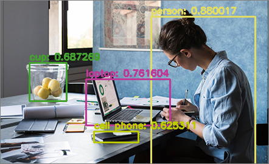

# Object-detector
This is a simple program that detects objects in static images or live webcam video feed.
It then highlights the bouding boxes and names of those obejcts in unique colors.
For object detection the [YOLOv2 model](https://pjreddie.com/darknet/yolov2/), trained on the [COCO dataset](http://cocodataset.org/) was used.
The COCO dataset contains 80 different object classes. The names of the object classes are available [here](https://github.com/pjreddie/darknet/blob/master/data/coco.names).

To run the program, download this repository as a zip or clone it. Then download the [coco.names](https://github.com/pjreddie/darknet/blob/master/data/coco.names), YOLO [config](https://github.com/pjreddie/darknet/blob/master/cfg/yolov2.cfg) and [weights](https://pjreddie.com/media/files/yolov2.weights) files and place them inside a folder named **"yolo-coco"** inside the **Object-detector-master** directory. Then open the terminal inside the **Object-detector-master** folder and enter the following command: `python yolo.py`. Then select the option to detect objects in images or webcam feed.

Alternatively, you could also run `yolo_img.py` or `yolo_cam.py` if you want.
